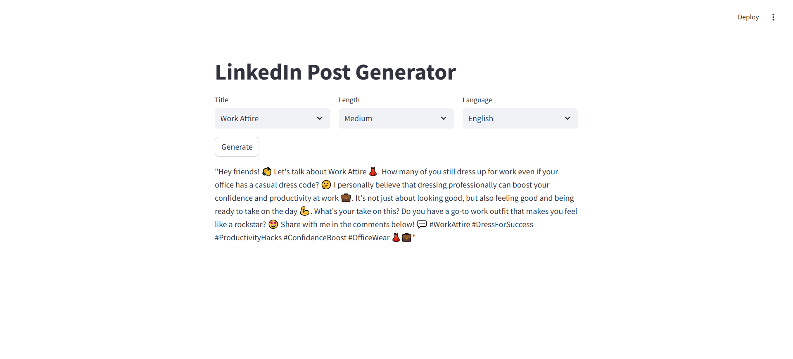

# LinkedIn Post Generator 🤖✍️

Generate professional and casual LinkedIn posts effortlessly with AI — powered by the Groq LLaMA model.  
Supports both Arabic (Jordanian dialect) and English posts via a simple, clean Streamlit web interface.

---

## Features 🌟

- Generate posts in **Arabic** and **English** 🌍  
- Choose tone: **Professional** or **Casual** 💼🎉  
- Customize post length: **Short**, **Medium**, or **Long** 📏  
- Uses real LinkedIn post data for natural-sounding content 📝  
- Easy-to-use UI built with **Streamlit** 💻  
- Open-source and ready for contributions 🔓

---

## How It Works 🔧

- **Data:** Trained on small authentic LinkedIn posts (few shots)  
- **Model:** Powered by Groq LLaMA 4-scout 17B (or your chosen model) 🤖  
- **UI:** Streamlit frontend for simple, interactive post generation  
- **Languages:** Supports Arabic and English

---

## Demo Screenshot




## Getting Started 🚀

### Prerequisites 🛠️

- Python 3.x  
- Groq API Key (set as environment variable) 🔑  
- Streamlit for the web interface

### Installation 
    git clone https://github.com/reema-abdelrazeq/linkedin-post-generator.git
    cd linkedin-post-generator
    pip install -r requirements.txt

Create a .env file in the project root and add:
GROQ_API_KEY=your-groq-api-key

## Docker Setup (Optional) 🐳
1. Build the Docker image:
   ```bash
    docker build -t linkedin-post-generator .
2. Run the Docker container:
   ```bash
   docker run -p 8501:8501 --env-file .env linkedin-post-generator
Make sure your Groq API key is set in .env and the .env file is accessible during build or runtime.

## Future Improvements 🚀
- Add tone/style customization beyond professional/casual
- Add scheduling and posting integration for LinkedIn
- Improve UI/UX and add post preview features

